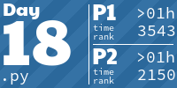

# Advent of Code

https://adventofcode.com/

To run any of the solutions, you need to be in the solutions/ directory because
that's how I lazily hard coded the code for getting the test file inputs.

# Results By Year
<!-- AOC TILES BEGIN -->
<h1 align="center">
  2023 - 50 ⭐
</h1>

<h1 align="center">
  2022 - 26 ⭐
</h1>

<h1 align="center">
  2021 - 36 ⭐
</h1>

<!-- AOC TILES END -->
